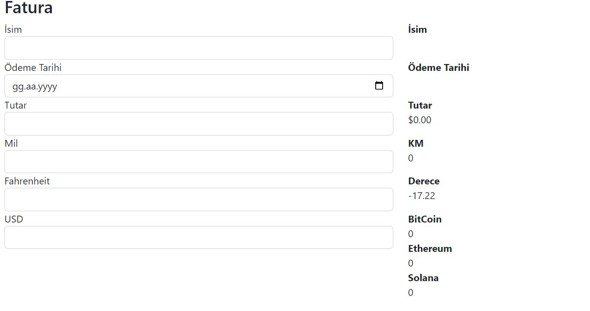
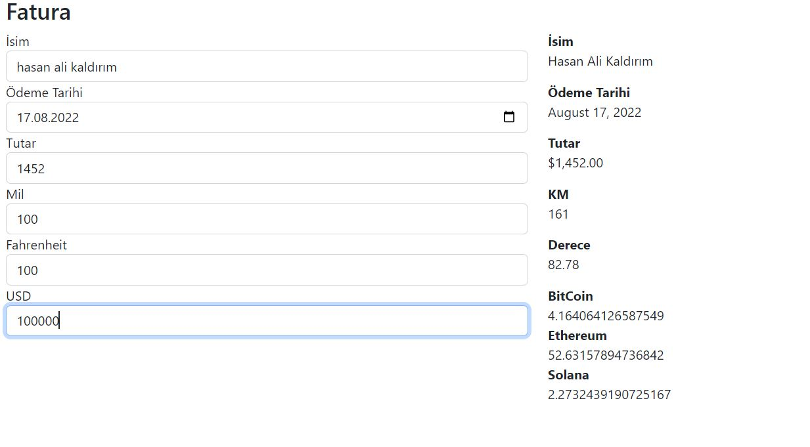

# Angular-Pipes-Ornek-Proje
Angular Pipes Ornek Proje
#
- Proje, Angular Pipes konusunun öğreniminde örnek olması için yapıldı.
- Projede hazır pipe'lar ve oluşturduğum custom pipe'lar kullanıldı.

- İlk kullanılan pipe, girilen metnin baş harflerini büyük yapar.
- İkinci pipe, takvimden seçilen tarihe göre belli formatta tarih verir.
- Üçüncü pipe, girilen tutarı dolar cinsinden verir.
- Dördüncü pipe, custom olarak oluşturuldu. Uzunluğu mil'den kilometreye çevirir.
- Beşinci pipe, custom olarak oluşturuldu. Sıcaklığı Fahrenheit'tan Celcius'a çevirir.
- Altıncı pipe, custom olarak oluşturuldu. Girilen dolar tutarına göre bazı kripto para birimlerinin karşılıklarını verir.
 
 #
* Proje Angular kullanılarak oluşturuldu.
* Bootstrap ile görüntü düzenlendi.
#

